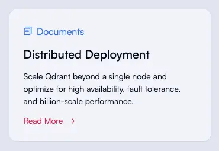
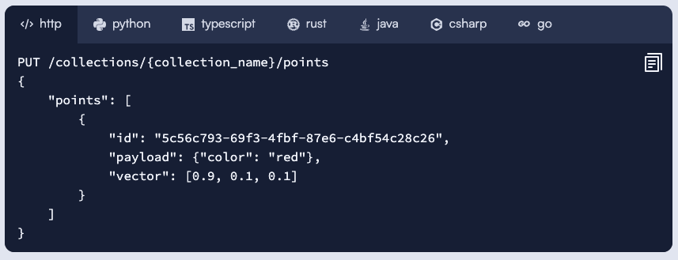

# Index
- [Running locally](#running-locally)
  - [Prerequisites](#prerequisites)
    - [Required](#required)
    - [Needed only for development](#needed-only-for-development)
      - [Updating npm dependencies via hugo](#updating-npm-dependencies-via-hugo)
  - [Run](#run)
  - [Run with drafts](#run-with-drafts)
  - [Build css from scss](#build-css-from-scss)
- [Content Management](#content-management)
  - [Main Page](#main-page)
    - [Customers/Partners Logos](#customerspartners-logos)
  - [Articles](#articles)
    - [Metadata](#metadata)
    - [Preview image mechanism](#preview-image-mechanism)
    - [Article preview](#article-preview)
  - [Documentation](#documentation)
    - [Metadata](#metadata-1)
    - [Preview images for documentation pages](#preview-images-for-documentation-pages)
    - [Documentation sidebar](#documentation-sidebar)
      - [Delimiter](#delimiter)
      - [External link](#external-link)
      - [Params](#params)
  - [Blog](#blog)
    - [Images](#images)
    - [Important notes](#important-notes)
  - [Shortcodes 🧩🧩🧩](#shortcodes-)
    - [Built-in shortcodes](#built-in-shortcodes)
    - [Custom shortcodes](#custom-shortcodes)
      - [🧩 Card](#-card)
      - [🧩 Grid Row](#-grid-row)
      - [🧩 Banner](#-banner)
      - [🧩 Code Snippets Widget](#-code-snippets-widget)
        - [📁 Directory Structure](#-directory-structure)
        - [▶️ Example Usage](#-example-usage)
        - [⚙️ Parameters](#-parameters)
        - [⚠️ Notes](#-notes)
        - [🚫 Limitations](#-limitations)


# Running locally

## Prerequisites

### Required

- [Hugo](https://gohugo.io/getting-started/installing/)

### Needed only for development

- [Node.js](https://nodejs.org/en/download/)
- [npm](https://www.npmjs.com/get-npm)
- [Dart Sass](https://sass-lang.com/install) - Don't use the npm package `sass` as it's a different implementation of Sass

#### Updating npm dependencies via hugo

1. Go to `qdrant-landing/themes/qdrant-2024/package.hugo.json` and configure desired versions of npm packages.
2. Run `hugo mod npm pack` to update the `qdrant-landing/themes/qdrant-2024/package.json` file from `qdrant-landing/themes/qdrant-2024` directory.
3. Go to `qdrant-landing` and run `hugo mod npm pack` again to update global `package.json` file.
4. Run `npm install` to install the updated dependencies.


## Run

```bash
cd qdrant-landing
hugo serve
```

Open http://localhost:1313/ in your browser.

### Run with drafts

If your changes are not shown on the site, check if your markdown file has `draft: true` in the header.

Drafts are not shown by default. To see drafts, run the following command:

```bash
cd qdrant-landing
hugo serve -D
```

## Build css from scss

For the previous theme, it was required to build CSS files. We don't need to build CSS from SCSS anymore explicitly. It's done automatically by Hugo using Dart Sass, which should be installed on your machine to see results).

# Content Management

To add new content to the site, you need to add a markdown file to the corresponding directory. The file should have a header with metadata. See examples below.

Do not push changes to the `master` branch directly. Create a new branch and make a pull request.

If you want to make your changes live, you need to merge your pull request to the `master` branch. After that, the changes will be automatically deployed to the site.

## Main Page

### Customers/Partners Logos

To add a customer logo to the marquee on the main page:

1. Add a logo to `/qdrant-landing/static/content/images/logos` directory. The logo should be in PNG format and have a transparent background and a width of 200px. The color of the logo should be `#B6C0E4`.

2. Add a markdown file to `content/stack` directory using the next command (replace `customer-name` with the name of the customer):

``` bash
cd qdrant-landing
hugo new --kind customer-logo stack/customer-name.md
```

Edit the file if needed.

3. If the total number of slides changed - update `static/css/main.scss` file. Find line:

```scss
@include marquee.base(80px, 200px, 13, 6, 20px, false, 50s);
```

and change 13 to the number of logos.

Rebuild CSS from SCSS (see instructions [above](#build-css-from-scss)).

4. To change order of the logos - add or change `weight` parameter in the markdown files in `/qdrant-landing/content/stack` directory.


## Articles

### Metadata

Articles are written in markdown and stored in `content/articles` directory. Each article has a header with metadata:

```yaml
---
title: Here goes the title of the article #required
short_description: Short description of the article
description: This is a longer description of the article, you can get a little bit more wordly here. Try to keep it under 140 characters. #required
social_preview_image: /articles_data/cars-recognition/social_preview.jpg # This image will be used in social media previews, should be 1200x630px. Required.
small_preview_image: /articles_data/cars-recognition/icon.svg # This image will be used in the list of articles at the footer, should be 40x40px
preview_dir: /articles_data/cars-recognition/preview # This directory contains images that will be used in the article preview. They can be generated from one image. Read more below. Required.
weight: 10 # This is the order of the article in the list of articles at the footer. The lower the number, the higher the article will be in the list.
author: Yusuf Sarıgöz # Author of the article. Required.
author_link: https://medium.com/@yusufsarigoz # Link to the author's page. Required.
date: 2022-06-28T13:00:00+03:00 # Date of the article. Required.
draft: false # If true, the article will not be published
keywords: # Keywords for SEO
  - vector databases comparative benchmark
  - benchmark
  - performance
  - latency
---
```

### Preview image mechanism

Preview image for each page is selected based on the following places in the following order:

- If the document has param `social_preview_image` - it will be used as the preview image
- If there is a file `static/<path-to-section>/<file-name>-social-preview.png` - it will be used as the preview image
- Global `preview_image = "/images/social_preview.png"` will be used as the preview image

### Article preview

Article preview is a set of images that will be used in the article preview. They can be generated from one image. To generate preview images, you need to have [ImageMagick](https://imagemagick.org/index.php) and [cwebp](https://developers.google.com/speed/webp/download) installed.

You can install `cwebp` with the following command:

```bash
curl -s https://raw.githubusercontent.com/Intervox/node-webp/latest/bin/install_webp | sudo bash
```

For **macOS**, you'll have to install `coreutils` too.

```
brew install coreutils
```

#### Prepare preview image

For the preview use an image with an aspect ratio of 3 to 1 in JPG or PNG format. With a resolution not smaller than 1200x630px. The image should illustrate in some way the article's core idea. Fill free got creative. Check out that the most important part of the image is in the center.

#### Generating preview images

To generate preview images, run the following command from the root of the project:

```bash
bash -x automation/process-article-img.sh <path-to-image> <alias-for-the-article>
```

For example:

```bash
bash -x automation/process-article-img.sh ~/Pictures/my_preview.jpg filtrable-hnsw 
```

This command will create a directory `preview` in `static/article_data/filtrable-hnsw` and generate preview images in it. If the directory `static/article_data/filtrable-hnsw` doesn't exist, it will be created. If it exists, only files in the children `preview` directory will be affected. In this case, preview images will be overwritten. Your original image will not be affected.

For **macOS** you'll have to make 2 adjustements to `process-img.sh` script which is run by `process-article-img.sh` script:

1. Exchange `stat -c %Y` with `stat -f %m`;
2. Exchange `realpath` with `grealpath`.

#### Preview images set

Preview images set consists of the following images:

`preview.jpg` - 530x145px (used on the article preview card **for browsers, not supporting webp**)
`preview.webp` - 530x145px (used on the article preview card **for browsers, supporting webp**)
`title.jpg` - 898x300px (used on the article's page as the main image before the article title **for browsers, not supporting webp**)
`title.webp` - 898x300px (used on the article's page as the main image before the article title **for browsers, supporting webp**)
`social_preview.jpg` - 1200x630px (used in social media previews)

## Documentation

### Metadata

Documentation pages are written in markdown and stored in `content/documentation` directory. Each page has a header with metadata:

```yaml
---
title: Here goes the title of the page #required
weight: 10 # This is the order of the page in the sidebar. The lower the number, the higher the page will be in the sidebar.
canonicalUrl: https://qdrant.io/documentation/ # Optional. This is the canonical URL of the page.
hideInSidebar: true # Optional. If true, the page will not be shown in the sidebar. It can be used in regular documentation pages and in documentation section pages (_index.md).
---
```

### Preview images for documentation pages

Branded individual preview images for documentation pages might be auto-generated using the following command:

(from the root of the project)

```bash
bash -x automation/generate-all-docs-preview.sh
```

It will automatically insert the documentation Section name and Title of the page into the preview.
If there is a custom background for the image - it should be placed in the `static/documentation/<section-name>/<page>-bg.png`.
<!-- (Use midjourney and one of the styles https://www.notion.so/qdrant/Midjourney-styles-a8dbc94761a74bb287a8a8ad05d593d1 to generate the background) -->

If there is no custom background - a random default background will be used.

Generated images will be placed in the `static/documentation/<section-name>/<page>-social-preview.png`.

To re-generate the preview image, remove the previously generated one and re-run the command.

### Documentation sidebar

#### Delimiter

To create a delimiter in the sidebar, use the following command:

``` bash
cd qdrant-landing
hugo new --kind delimiter documentation/<delimiter-title>.md
```

It will create a file `content/documentation/<delimiter-title>.md`.

To put a delimiter to the desired place in the sidebar, set the `weight` parameter to the desired value. The lower the value, the higher the delimiter will be in the sidebar.

#### External link

To create an external link in the sidebar, use the following command:

``` bash
cd qdrant-landing
hugo new --kind external-link documentation/<link-title>.md
```

It will create a file `content/documentation/<link-title>.md`. Open it and set the `external_link` parameter to the desired value.

#### Params

Additionally, to the standard Hugo front matter params, we have the following params:

```yaml
hideInSidebar: true
```

If `true`, the page will not be shown in the sidebar. It can be used in regular documentation and section pages (_index.md).

## Blog

To add a new blog post, run the following commands:

``` bash
cd qdrant-landing
hugo new --kind blog-post blog/<post-title>.md
```

You'll see a file named `content/blog/<post-title>.md`. Open it and edit the front matter.

### Images

Store images for blog posts in the following subdirectory: `static/blog/<post-title>`. You can add nested directories if needed. For social media previews, use images of at least 1200x600px.

In the blog post file, you'll see:

- `preview_image`: The image that appears with the blog post. If you want different images for social media, the blog post title, or the preview, use the following properties:

  - `social_preview_image`
  - `title_preview_image`
  - `small_preview_image`

- 

### Important notes

- Add tags. While they're not shown on the blog post page, they are used to display related posts.
- If a post has `featured: true` property in the front matter this post will appear in the "Features and News" blog section. Only the last 4 featured posts will be displayed in this section. Featured posts will not appear in the regular post list.
  - If there are more than 4 `featured: true` posts (where `draft: false`), the oldest post disappears from /blog.

## Shortcodes 🧩🧩🧩

Hugo lets you use built-in and custom shortcodes to simplify the creation of content. Meanwhile, **keep in mind that shortcodes make the content less portable**. If you decide to move the content to another platform, you'll need to rewrite the shortcodes. **Avoid to overuse them.**

You can use shortcodes in markdown files by enclosing the shortcode in double curly braces. For example:

```markdown

```

### Built-in shortcodes

List of built-in shortcodes can be found in the [Hugo documentation](https://gohugo.io/content-management/shortcodes/).

If you use a shortcode in your markdown file, but it fails to render, check if the shortcode is available with the Hugo version the site is built with.

### Custom shortcodes

You can find the list of available shortcodes in the `qdrant-landing/themes/qdrant/layouts/shortcodes` directory.

#### 🧩 Card
- Card - variant 1

  

Example:
```

  This guide will help you get started with Qdrant locally.  

```

- Card - variant 2

  

Example:
```

  This guide will help you get started with Qdrant locally.  

```

Parameters for card shortcode:
- `title` - required
- `link` -required
- `image` - optional, default null
- `type` - optional, default "Document"
- `icon` - optional, default is an icon of documents
- `col` - optional, default 12

Card variant 1 is the default; you can optionally change the icon and type, if you use `image` option, you will get variant 2, type and icon will be ignored even if given.

<hr>

#### 🧩 Grid Row

Cards should be enclosed in a row shortcode if you want to have more than one card in a row.

Example:
```

  
      This is a first card.  
  
  
      This is a second card.
  

```

Each card will take up half of the row in the example above.

<hr>

#### 🧩 Banner


Example:
```
  
  This guide will help you get started with Qdrant locally.  

```

Parameters for banner shortcode:
- `link` - required
- `cta` - optional, default "Get Started"
- `image` - optional, default "/img/rocket.svg"

<hr>

#### 🧩 Code Snippets Widget



This shortcode renders a code snippets widget from a specified path.
Use it when you want to manage code examples as a collection of separate Markdown files.

##### 📁 Directory Structure
Place all code snippets for a single widget into one directory. Each file should be named after the programming language it represents:

```
points-id/
├── http.md
├── python.md
├── go.md
```
File names are used for sorting. It's recommended to name files according to the language they contain (e.g., python.md, go.md). Sorting is controlled by the order parameter or the snippetsOrder parameter (see below).

Each file should contain a code snippet in a fenced code block (```).

##### ▶️ Example Usage
``` hugo

``` 

##### ⚙️ Parameters
- `path` (required) – Path to the directory (inside content/) containing the snippet files.
- `order` (optional) – Space-separated list of snippet names to display first. Remaining files will be rendered in the order they appear in the directory. Sorting is based on file names (without .md).

You can also define a global default snippet order using the snippetsOrder parameter in the relevant section’s _index.md.

##### ⚠️ Notes
**Important:** Turn off rendering for the snippets directory if it's not already disabled in its parent section. Otherwise, Hugo will attempt to generate standalone pages for these files.

You can include multiple snippets in a single Markdown file, but in that case, the order parameter has no effect—they will render in the order they appear in the file.

##### 🚫 Limitations
Snippet files must not contain front matter (---). Each code snippet should be a fenced code block (```).

The snippetsOrder parameter only works at the section level or deeper. If you're adding snippets to a section for the first time, make sure to define snippetsOrder in that section’s or a child section’s _index.md.


## SEO

### Structured data (Schema.org, JSON-LD)

Structured data is a standardized format for providing information about a page and classifying the page content. It is used by search engines to understand the content of the page and to display rich snippets in search results.

We use JSON-LD format for structured data. Data is stored in JSON files in the `/assets/schema` directory. If no specific schema is provided for a page, the default schema is used based on the page type as defined in the `qdrant-landing/themes/qdrant/layouts/partials/seo_schema.html` file.

To add schema to a specific page, use the `seo_schema` or `seo_schema_json` parameter in the front matter of content markdown files (directory `content`).

To add JSON directly to the page, use the `seo_schema` parameter. The value should be a JSON object.

Example:

```yaml
seo_schema: {
    "@context": "https://schema.org",
    "@type": "Organization",
    "name": "Qdrant",
    "url": "https://qdrant.io",
    "logo": "https://qdrant.io/images/logo.png",
    "sameAs": [
      "https://www.linkedin.com/company/qdrant",
      "https://twitter.com/qdrant"
    ]
  }
```

To add a path to a JSON file with schema data, use the `seo_schema_json` parameter. This parameter should contain a list of paths to JSON files.
The path should be relative to the `qdrant-landing/assets` directory.

Example:

```yaml
seo_schema_json:
  - schema/schema-organization.json
  - schema/product-schema.json
```

If you want to add a new schema, create a new JSON file in the `qdrant-landing/assets/schema` directory and add the path to the `seo_schema_json` parameter.

When use `seo_schema` and `seo_schema_json` together, `seo_schema` will be used additionally to `seo_schema_json` adding the second <script> tag with the `seo_schema` value.

Use `seo_schema_json` if you want to reuse the same schema for multiple pages to avoid duplication and make it easier to maintain.

[To Index](#index)