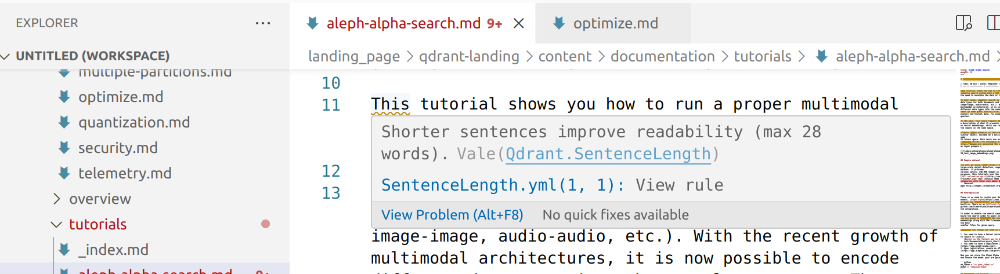

# English grammar linter (Vale)

This repository includes `beta` rules based on the [Vale grammar linter](https://vale.sh). While the [installation instructions](https://vale.sh/docs/vale-cli/installation/#package-managers) cover Mac and Windows, I've installed Vale on Ubuntu Linux. Vale includes
installation binaries in one of their [Git repositories](https://github.com/errata-ai/vale/releases).

You can integrate [Vale as a plugin](https://vale.sh/docs/integrations/guide/) with 
several different IDEs. This README illustrates integration between Vale and VSCode.

Vale pulls rules from YAML files in the `styles/` subdirectory. They include grammar rules in the following subdirectories:

- Modified rules from GitLab in the `styles/Qdrant/` subdirectory
- [Google Developer Style Guide](https://github.com/errata-ai/Google) rules, customized for Vale, in the `styles/Google` subdirectory
- Rules associated with the [write-good](https://github.com/btford/write-good) grammar linter

These rules are a "Work in Progress"; we may overrule/modify them as we use them to review Qdrant content. For example, if you find a common word / acronym that we use, you're
welcome to add it (with a PR) to our `styles/cobalt/spelling-exceptions.txt` file.

For more information, see the [Vale documentation](https://vale.sh/).

## Vale configuration

The Vale configuration file is .vale.ini. In this file, we see: 

- The `StylesPath` points to rules in the `styles/` subdirectory.
- The `BasedOnStyles` parameter specifies style subdirectories.
- The `IgnoredScopes` tells Vale to ignore content such as code samples, as described in [Vale Documentation](https://vale.sh/docs/topics/config/#ignoredscopes).

Tip: If you want Vale to ignore code, surround it with code sample marks such as:

- `Vale_ignores_this`
```
Vale also ignores this
```

## Use Vale in your IDE

You can set up Vale with several different IDEs. For more information, see the
[Integrations](https://vale.sh/docs/integrations/guide/) section of the Vale documentation.

For example, you can set up a Vale plugin with the VSCode IDE, per
https://github.com/chrischinchilla/vale-vscode.

If you have problems with Vale in VSCode, you may need to:

- Restart VSCode
- Disable / re-enable the Vale plugin
- Save changes to the Markdown file that you're analyzing

If you're successful, you'll see linting messages similar to what's shown in the following screenshot:

<p align="center">
    
</p>

## Use Vale at the command line

To review your content against the given style guide rules, first navigate to
the `qdrant-landing/` directory for this repository. Then run the following
command:

```
vale /path/to/your/filename.md
```

As long as you're in the `qdrant-landing/` directory, you can use Vale at the command line to lint Markdown files in any local directory.

## Potential future options

- Include Vale in CI/CD jobs

  - Set up a GitHub action

- Apply vale to articles and blog posts

  - Guess: we need different rules. Default rules for documentation suggest:

    - Use "second person"
    - Avoid future tense
    - Don't use exclamation points
    - Avoid words like "easy" and "simple"

    These rules generally do not apply to articles or blogs.
