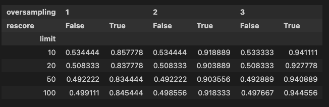

# Mistral
Qdrant is compatible with the new released Mistral Embed and its official Python SDK that can be installed as any other package:

## Setup

### Install the client

```bash
pip install mistralai
```

```python
from mistralai.client import MistralClient

api_key = os.environ["MISTRAL_API_KEY"]
client = MistralClient(api_key=api_key)
```

Let's see how to use the Embedding Model API to embed a document for retrieval. 

The following example shows how to embed a document with the `models/embedding-001` with the `retrieval_document` task type:

## Embedding a document

```python
import pathlib
from mistralai.client import MistralClient
import qdrant_client

MISTRAL_API_KEY = "YOUR MISTRAL API KEY"  # add your key here

mistral_client = MistralClient(api_key=MISTRAL_API_KEY)

result = mistral_client.embeddings(
        model="mistral-embed", input=["Qdrant is the best vector search engine to use with Mistral"]
    )
```

The returned result is a dictionary with a key: `embedding`. The value of this key is a list of floats representing the embedding of the document.

## Searching for documents with Qdrant

Once the documents are indexed, you can search for the most relevant documents using the same model with the `retrieval_query` task type:

```python
qdrant_client.search(
    collection_name="MistralCollection",
    query=client.embeddings(
        model="mistral-embed", input=["What is the best to use with Mistral?"]
    )["embedding"],
)
```

## Using Mistral Embedding Models with Binary Quantization

You can use Mistral Embedding Models with [Binary Quantization](/articles/binary-quantization/) - a technique that allows you to reduce the size of the embeddings by 32 times without losing the quality of the search results too much. 

At an oversampling of 3 and a limit of 100, we've a 95% recall against the exact nearest neighbors with rescore enabled.



That's it! You can now use Mistral Embedding Models with Qdrant!